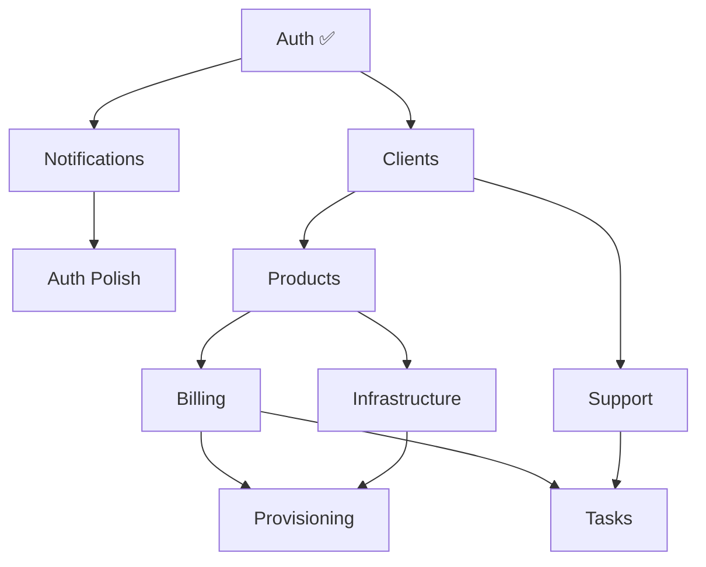

# Roadmap de Sprints — Recomendación Crítica

## El problema

Si seguimos avanzando sin email funcional, **cada sprint que toque email acumula deuda técnica**:
- Auth: 5 flujos dependen de email (verificación, 2FA, reset) 
- Billing: facturas, cobros fallidos, renovaciones
- Support: respuestas a conversaciones
- Tasks: asignaciones, alertas críticas
- Clients: bienvenida, onboarding

Cada `// TODO: Send email` es una bomba de relojería. En producción esto se convierte en bugs difíciles de rastrear porque nunca se testaron end-to-end.

## Grafo de dependencias real



## Recomendación: Bottom-Up con Notifications como Sprint 2

### Fase 1 — Cimientos (localhost, testable end-to-end)

| Sprint | Módulo | Qué incluye | Por qué ahora |
|--------|--------|-------------|----------------|
| 0 | Scaffolding | ✅ Hecho | — |
| 1 | Auth | ✅ Hecho (backend completo, frontend login+2FA) | — |
| **2** | **Notifications Core** | Transporte email (nodemailer) + notificaciones internas (campana) + plantillas base | **Desbloquea todos los flujos de email de todos los sprints futuros. Sin esto, nada se puede testar end-to-end.** |
| **2.1** | **Auth Polish** | Páginas frontend: registro, verificar email, forgot password, reset password | Con email funcional, ahora sí se puede probar el ciclo completo |
| 3 | Clients | Ficha CRM, perfil de facturación, notas internas, contexto del negocio | Base de datos de clientes necesaria para todo lo demás |
| 4 | Products | Catálogo dinámico, configuración, pricing, ciclos de facturación | Necesario antes de billing |

### Fase 2 — Lógica de negocio (localhost)

| Sprint | Módulo | Qué incluye | Depende de |
|--------|--------|-------------|------------|
| 5 | Billing | Facturas, cobros, Stripe, renovaciones | Clients + Products |
| 6 | Support | Chat (Socket.io), conversaciones asíncronas, filtro IA | Clients + Notifications |
| 7 | Tasks | Tareas automáticas, WOW calls, mantenimiento, checklists | Clients + Billing |
| 8 | Audit | Portal de transparencia del cliente, logs de acceso/cambio | Clients (la escritura de audit ya funciona) |

### Fase 3 — Infraestructura y producción

| Sprint | Módulo | Qué incluye | Depende de |
|--------|--------|-------------|------------|
| 9 | Infrastructure | Servidores, pools, métricas de capacidad | Products |
| 10 | Provisioning | Docker engine, Enhance CP, orquestación | Infrastructure + Billing |
| 11 | Hardening | httpOnly cookies, rate limiting fino, CORS prod, monitoring | Todo |
| 12 | Deploy | Docker Compose prod, Traefik, SSL, Grafana+Prometheus | Todo |

## Por qué Notifications primero y no después

> **Regla profesional**: Nunca construyas sobre cimientos que no puedes testar.

Si construimos Clients y Billing sin email:
1. El registro de cliente no se puede verificar end-to-end
2. Las facturas se generan pero no se notifican
3. Los cobros fallan y nadie se entera
4. Cuando finalmente lleguemos a Notifications, tendremos que volver a CADA módulo a testar integración

**Con Notifications como Sprint 2:**
- Cada sprint posterior se testa completo antes de avanzar
- Zero deuda técnica acumulada
- El `// TODO: Send email` desaparece del código para siempre

## Qué NO es Sprint 2 (Notifications)

Sprint 2 NO es el sistema completo de notificaciones con plantillas editables, WhatsApp y editor visual. Eso vendrá con los sprints de Support y la página de configuración.

Sprint 2 es solo:
1. **EmailService** — nodemailer con SMTP configurable (MailPit en dev, SMTP real en prod)
2. **Notificaciones internas** — tabla + endpoint para la campana del dashboard
3. **Plantillas base** — 5-6 plantillas hardcodeadas para los flujos de auth
4. **MailPit en Docker** — servidor de email local para desarrollo (se ven todos los emails enviados en `localhost:8025`)

Estimación: ~2 horas de trabajo.

## Resumen

```
Sprint 0  ✅ Scaffolding
Sprint 1  ✅ Auth (backend)
Sprint 2  → Notifications Core (desbloquea email)
Sprint 2.1→ Auth Frontend Polish (registro, forgot, verify)
Sprint 3  → Clients
Sprint 4  → Products
Sprint 5  → Billing
Sprint 6  → Support
Sprint 7  → Tasks
Sprint 8  → Audit
Sprint 9  → Infrastructure
Sprint 10 → Provisioning
Sprint 11 → Hardening
Sprint 12 → Deploy
```
